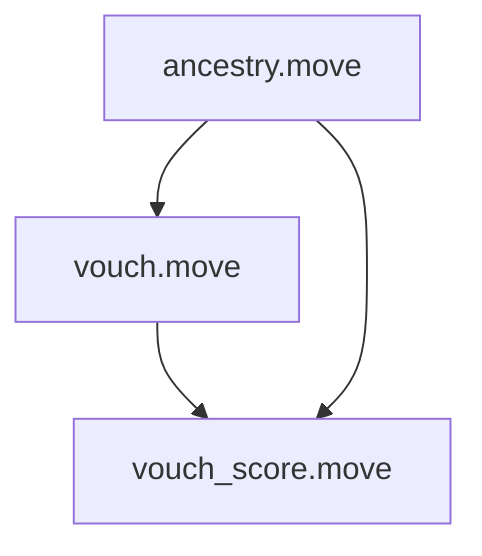

# Root of Trust System Analysis

## Core Modules

### 1. Ancestry Module
- **Purpose**: Maintains genealogical relationships between accounts
- **Key Features**:
  - Tracks account relationships in a tree structure
  - Prevents family members from vouching for each other
  - Private tree modification (users cannot change their own ancestry)
  - Friend-only access for sensitive operations

### 2. Vouch Score Module
- **Purpose**: Calculates trust scores based on ancestry and vouching
- **Key Features**:
  - Uses degree of separation for score calculation
  - Threshold score of 2 for valid vouching
  - Score calculation: `100/degree`
  - Filters out family members from vouching

## Key Relationships



## Security Model

1. **Ancestry Verification**
   - Trees cannot be modified by users
   - System maintains immutable relationship records
   - Genesis accounts form the root of trust

2. **Vouching Rules**
   - Family members cannot vouch for each other
   - Score decreases with genealogical distance
   - Multiple unrelated vouchers required for validity

3. **Trust Calculation**
   - Based on both direct (ancestry) and indirect (vouching) relationships
   - Weighted by degree of separation
   - Requires minimum threshold of unrelated vouchers

## Key Functions

### Ancestry Module
```move
public(friend) fun get_degree(ancestor: address, user: address): Option<u64>
public fun is_in_tree(ancestor: address, user: address): bool
public fun is_family(left: address, right: address): (bool, address)
```

### Vouch Score Module
```move
fun calculate_voucher_score(voucher: address, user: address): u64
fun get_total_vouch_score(user: address): u64
public fun is_voucher_score_valid(user: address): bool
```

## Usage Constraints
- Ancestry can only be modified through system operations
- Vouching requires unrelated accounts
- Trust scores depend on both relationship distance and number of vouchers
